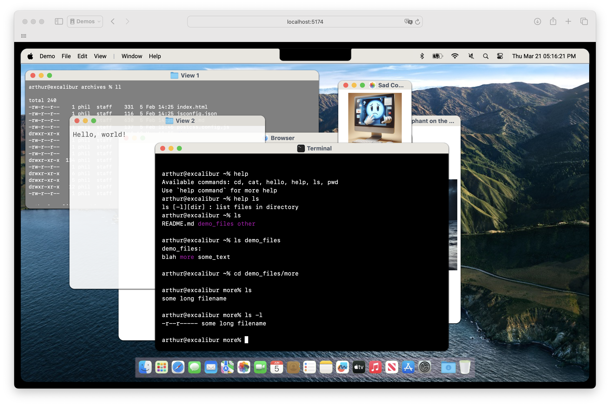

# macos-vue

A vue3-based Mac OS simulation



### Note

This is a work-in-progress - UNSTABLE.

### Features

- Menus: graphically functional, but no action on click
- Windows:
  - functional, except menu buttons: closing/minimizing/full-screen
  - background, foreground colors, and opacity can be changed
  - resizable and movable
- Text Viewer: shows some predefined text file (ANSI codes handled) or static text
- Photo Viewer: shows one picture
- Terminal Windows: functional, offers a few commands by default:
  - help [cmd]
  - ls [-l] [files]
  - cd [dir]
  - pwd
  - cat [file] (WIP)
  - you can use your own commands (passed as an array of simple objects)
- Browser: simple predefined URL browser, fully functional (iframe)

#### Caveats
- everything shown is **provided** by host
- browser can follow links.
- if user figures a way to go to risky sites, he endangers his own computer, not the host
- there's no state: if user refreshes the page, he restarts the interface.
- alt/ctrl-tab are not captured inside the UI (can't be done, to my knowledge)
- some URL won't work, due to Cross-Site Restrictions (e.g. Wikipedia works, Google doesn't...):
you can browse a local page from the host itself, but are limited to external sites  

#### TO DO
- click in menus
- PDF viewer (iframe?)
- more base terminal command
- use of icons in docking bar
- auto-hiding docking bar
- browser URL can be changed (started, but got some issues with that)
- other...

### Install

#### Add package

`npm install --save @peergum/macos-vue`

#### Include in your app

main.js:

```vue
import {createApp} from 'vue'
import App from './App.vue'

import MacOS from "macos-vue";
import "macos-vue/dist/style.css";

createApp(App)
.use(MacOS)
.mount('#app')
```

component usage:

```vue

<script setup>
  const defs = {
    // environment definitions, see below
  }
</script>

<template>
  ...
  <MacOS :definitions="defs"/>
  ...
</template>
```

### Configuration

The configuration parameter describes your whole MacOS environment:

```js
const defs = {
  menu: {
    items: menu_items,
  },
  windows: [
    window_list,
  ],
  system: {
    dir: directory_structure,
    user: "user_name",
    host: "host_name",
  },
};

const menu_items = [
{
name: "menu1", // usually App name
menu: [
    {
        name: "option1",
        menu: [
            {
                name: "suboption1",
            },
            {
                name: "suboption2",
            },
            {
                name: "---", // horizontal separator
            },
            {
                name: "suboption3",
            },
            ...
        ],
    },
    {
        name: "option2",
        menu: [
            ...
        ],
    },
    {
        name: "---", // vertical separator
    },
    ...
];

const window_list = [
    window1_def,
    window2_def,
    ...
];


// viewer window
const viewer_def: {
    name: "View 1",
    icon: 'folder-sm.png', // folder icon
    type: 'viewer',
    bg: 'gray', // standard CSS color names or values
    text: 'white',
    w: 600, // a proportional value to virtual screen width (def: 1000)
    h: 400, // a proportional value to virtual screen height (def: 1000)
    x: 10, // proportional x (top left corner)
    y: 20, // proportional y (top left corner)
    contentUrl: './src/example/demo.txt', // a text file
    content: "test", // or a default static text
    class: 'text-xs', // additional class to pass
};


const picture_viewer = {
    name: "My Beautiful Picture",
    icon: 'photo-sm.png', // picture icon
    type: 'photo',
    picture: './src/example/designer.png', // picture to show
    x: 650, // proportional size and position
    y: 50,
    w: 150,
    h: 200,
};

const browser_window = {
    name: "My Browser",
    icon: 'safari-sm.png', // safari icon
    type: 'browser',
    w: 600, // proportional size + position
    h: 600,
    x: 200,
    y: 200,
    content: "https://wikipedia.org", // URL to browse
};

const terminal = {
  name: "Terminal",
  icon: 'terminal-sm.png', // terminal icon
  type: 'terminal',
  w: 600, // proportional size and position
  h: 600,
  x: 275,
  y: 230,
  bg: 'black', // colors
  text: 'white',
  commands: command_list, // list of commands 
};

const command_list = {
  "hello": [hello, "[name]", "say hello"], // function, args description, cmd description 
};

// example of command: should return a string ending with \n
// note: command is not passed as args[0]
const hello = (args) => {
  if (!args.length) {
    return "Hello to you too!\n";
  }
  return "Hello! But I'm no " + args[0] + "...\n";
};

// file system is simple: directory if an object, file if a string 
const directory_structure = {
  'demo_files': {
    'some_text': 'text',
    'blah': 'text',
    'more': {"some long filename": 'text'},
  },
  'other': {
    'blah.csv': 'text',
    'more_blah.csv': 'text',
    'worse.csv': 'text',
  },
  'README.md': 'text',
};
```

### License

```
    macos-vue component - This component simulates a Mac OS interface
    Copyright (C) 2024  Phil Hilger

    This program is free software: you can redistribute it and/or modify
    it under the terms of the GNU General Public License as published by
    the Free Software Foundation, either version 3 of the License, or
    (at your option) any later version.

    This program is distributed in the hope that it will be useful,
    but WITHOUT ANY WARRANTY; without even the implied warranty of
    MERCHANTABILITY or FITNESS FOR A PARTICULAR PURPOSE.  See the
    GNU General Public License for more details.

    You should have received a copy of the GNU General Public License
    along with this program.  If not, see <https://www.gnu.org/licenses/>.
```
